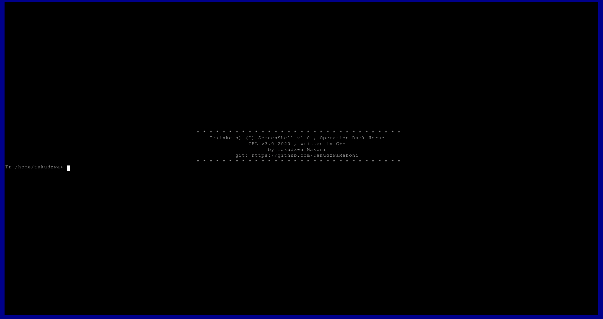
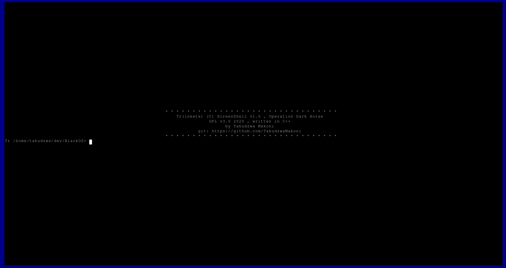
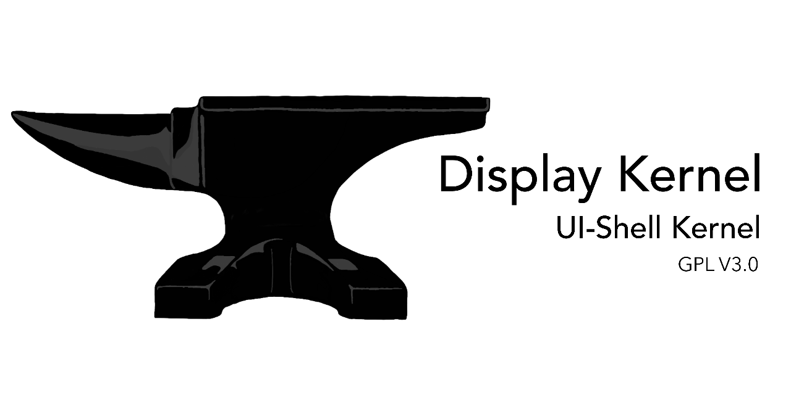

# ScreenShell

Trinkets ScreenShell (C) is a fullscreen shell which uses the DisplayKernel API to develop a powerful shellsurfing UI and a feature rich Terminal Shell superposed onto the default shell. It is based on an earler project which was essentially a few bash and python shortcuts and tools while using the terminal.

## starting the shell
After building from source, you can start the Trinkets Screenshell by running the binary Tr in Framework/Trinkets/ScreenShell.
Instead of moving this binary to bin in the PATH folder, i have made an alias for the binary in the build directory in the shell config file (e.g. for bash it is ~/.bashrc).

## list children in parent directory
The built in commands are named after their corresponding unix-like equivalent, including also optional flags. The ls command includes the option -a to show hidden files. It displays an ordered list of files in the given directory (the current directory as default if no directory parameter is entered), with information about each file.

## navigate the filesystem with 'nd' 
the built in command nd opens a UI window so that the user can navigate the filesystem, starting either at the current or some given directory, with option -a to show hidden files. When activated, the user can view directory contents, jump in and out of files using an editor, and change to a selected directory.

### editing files with 'nd' 

### switch on 'show hidden items' option 

### large number of files are automatically paginated

## shortcut to directories
sc is a built in command that opens a window containing a list of shortcuts and their paths, so that the user can quickly jump to that directory. Shortcuts can be added or removed by editing the file in home/user/.tr/shortcuts.txt

## customise and configure the shell
The shell can be customised by editing the file /home/user/.tr/config.txt. The user can map keys to actions, can change the theme and appearance of the shell. These configurations will be loaded on startup of the shell.

### changing themes 

The DisplayKernel (C) API features Methods for creating c++ programs with a terminal-based User Interface.

